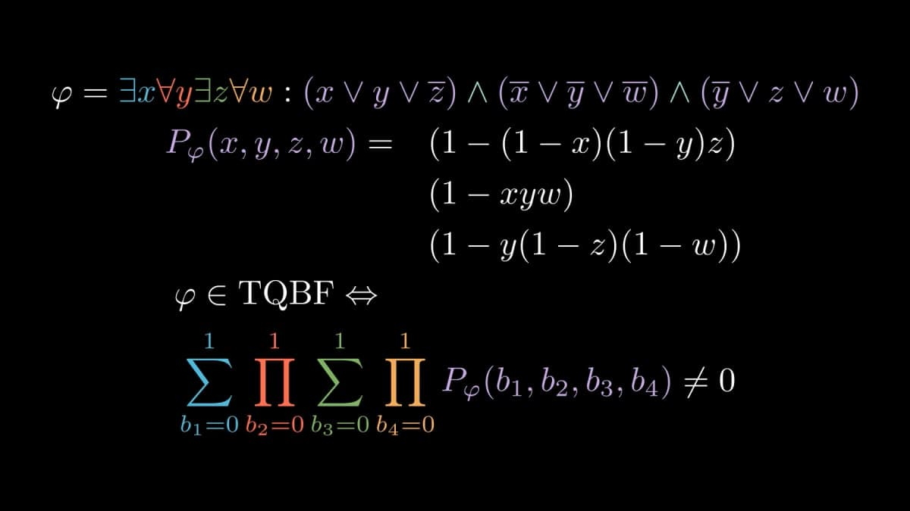
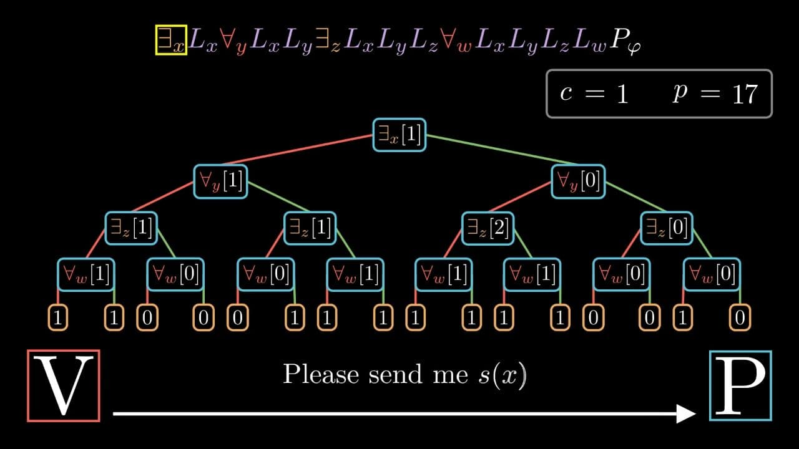
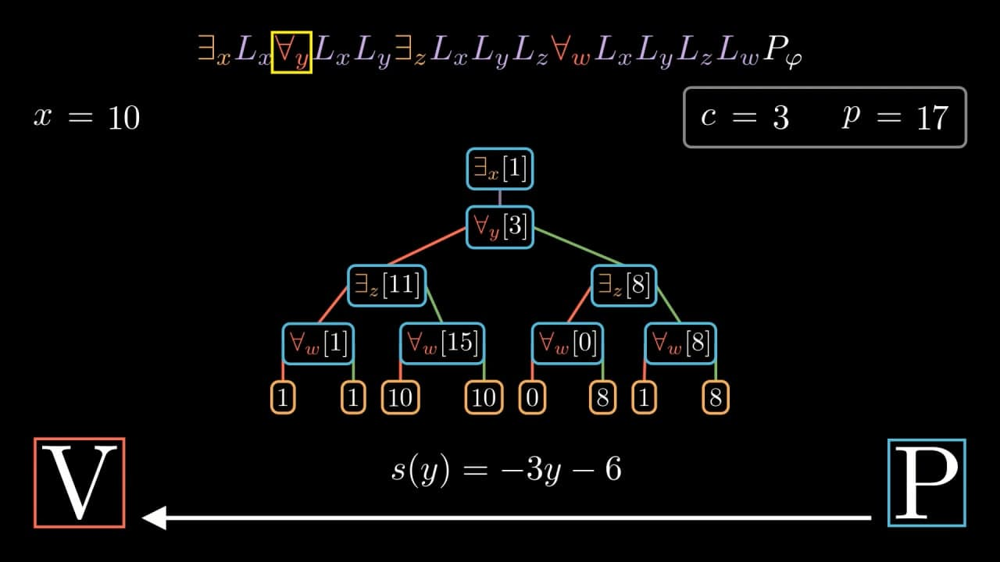
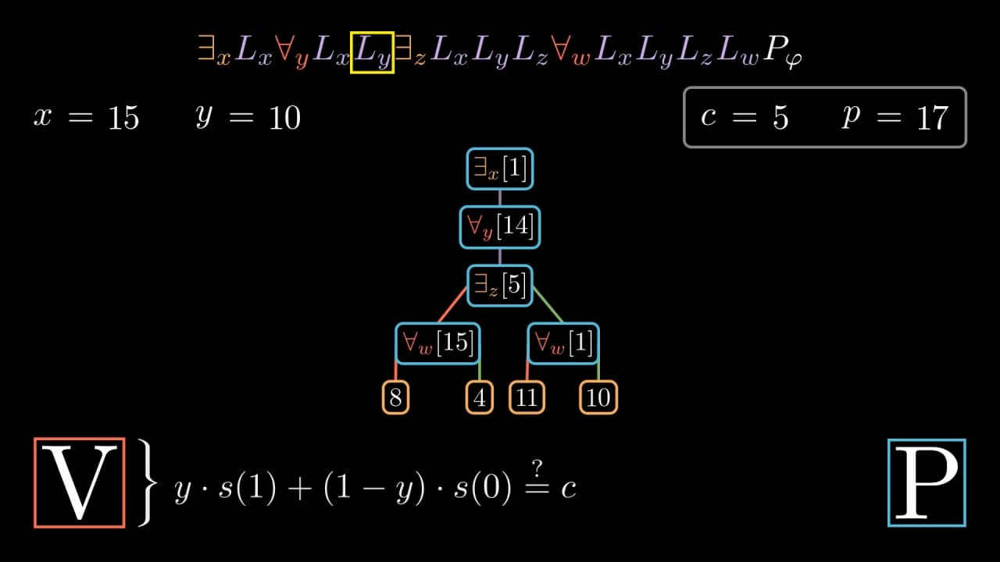
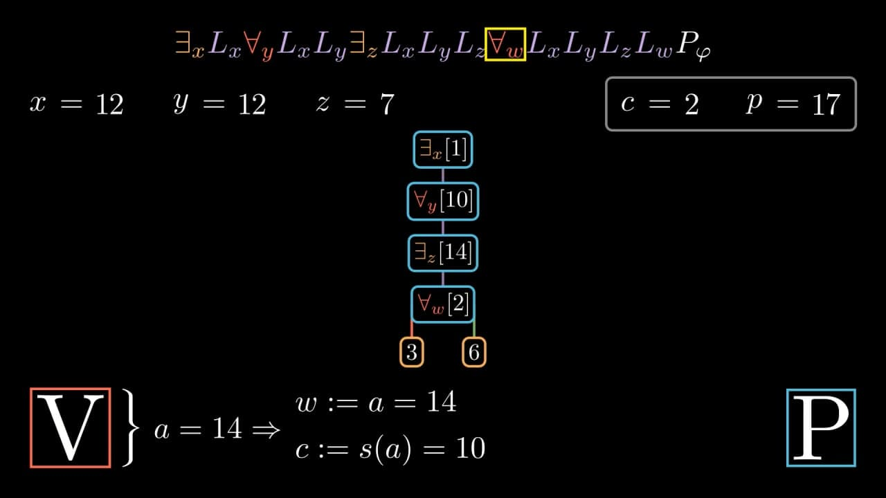

# TQBFIP

In complexity theory, it is well known that IP = PSPACE ([Shamir's Theorem](https://dl.acm.org/doi/10.1145/146585.146609)). It is not hard to see why IP is contained in PSPACE, so it suffices to show that PSPACE is contained in IP, which is done by constructing an interactive proof for TQBF (IP is closed under polynomial-time Karp reductions). This project contains an implementation of the interactive proof protocol for TQBF presented in [Shamir's paper](https://dl.acm.org/doi/10.1145/146585.146609), with the use of the linearization operator introduced by Shen in [this paper](https://dl.acm.org/doi/10.1145/146585.146613). For example, this project can be used to obtain a concrete interactive transcript of the communication between the prover and the verifier (see below for more details).

Apart from the implementation of the protocol itself, this project contains a clean, detailed & generic renderer of a video animation for the entire protocol. The goal of this animation is to visualize how exactly everything works in the protocol, both before as well as during the communication. Concretely, the following stages are animated:

* Arithmetization, that is, the conversion of the QBF matrix into a polynomial
* Communication between the prover and the verifier, that is, how the prover shows the validity of the QBF sentence and how the verifier interactively checks that the proof being presented is indeed correct.

Overall, this project is intended to be used for educational purposes.

## Installation

**Python version**: 3.9.5 or newer

**Required python dependencies**:

* [NumPy](https://numpy.org/) v1.19 or newer
* [SymPy](https://www.sympy.org/) 1.10.1 or newer
* [Manim Community Edition](https://www.manim.community/) v0.15.1 or newer

For the installation of the above libraries, make sure you follow the official guide available on the corresponding website. The Manim Community Edition library is used only for the animation rendering, you don't have to install it if you don't want to render animations.

## Usage

To execute the interactive protocol, run

```shell
python tqbfip.py <seed>
```

in the `src` directory. Here, by replacing `<seed>` with some integer, you can adjust the verifier's random number generator seed. This is useful when we want to execute the protocol multiple times without having the numbers the verifier chooses at random change every time.

By default, the protocol will be executed for the formula generated by `default_example_formula()` in `src/formulas.py`. To execute the protocol for a custom QBF sentence, construct it using the `QBF` class and pass it as an argument to `tqbfip(qbf, seed)`. You can find examples of formulas and the way they can be constructed in `src/formulas.py`. Please note that the `QBF` class supports only formulas already in prenex normal form with matrix in CNF. If this is not the case for your formula, first convert it into NNF, then bring quantifiers out and finally apply Tseitin's transformation to ensure that the matrix is in CNF.

Once the protocol execution has finished, you will find the interactive transcript of the communication in `logs/protocol.log`. More advanced prover-related information, such as the list of composed operator polynomials, is written to `logs/prover.log`.

### Animating arithmetization

To render the animation showing how the QBF matrix is arithmetized, run

```shell
python anim_arithmetization.py
```

from the `src` directory. This will render the animation in Full HD using default `manim` rendering options. Alternatively, you can render the animation by calling `manim` directly, that is, with the

```shell
manim -pql anim_arithmetization.py
```

command. Here, `-pql` stands for **p**lay, after rendering in **q**uality **l**ow. If you don't want the animation to be automatically played once rendering is complete, remove **p**. The rendering quality can be also changed from **l**ow to **m**edium or **h**igh. For more information regarding the `manim` command, see the [Manim documentation](https://docs.manim.community/en/stable/).

The resulting animation will build the arithmetizing polynomial step-by-step resulting in, for example,



at the end of the video. You can view the complete arithmetization animation produced for this formula [here](https://youtu.be/ZIR87YmcLME).

### Animating the interactive proof

Analogously to the above animation, the interactive proof can be animated by running

```shell
python anim_protocol.py
```

or, alternatively,

```shell
manim -pql anim_protocol.py
```

in the `src` directory. Rendering this animation will take considerably more time compared to the arithmetization animation discussed above. If you only need to animate a few first rounds, you can specify the amount of rounds to be animated via the `rounds_limit` parameter in the `ProtocolScene` constructor (`anim_protocol.py` module). If this parameter is set to `0`, all interactive rounds will be animated.

Here are some screenshots from the animation that gets produced for the above example formula:









The animation consists of the following parts:

* At the very top, the sequence of proof operators (with sprinkled-in linearization operators) for the formula is written down. In every round of communication, the proof operator corresponding to the beginning of the polynomial being considered, is highlighted with a yellow surrounding rectangle.
* Below the sequence of proof operators, the values that the verifier has assigned to variables so far, are displayed. The `c` variable on the right is what the value the verifier expects the polynomial to take. In other words, the verifier expects the prover to show that the polynomial evaluates to that value. If the prover fails to show that, the verifier will reject the proof. The `p` variable is constant and just represents the size of the finite field we are working in.
* In the center of the animation, the sequence of proof operators is visualized using a tree. This visualization allows us to very clearly see, in particular, the connection between `c` and the sequence of proof operators, or, in other words, value of what part of the polynomial is being currently discussed between the prover and the verifier.
* In the bottom corners, the `V` and `P` stand for verifier and prover, respectively. Between these labels, the communication is visualized. In particular, it is visualized which messages both parties exchange and how the verifier checks that what the prover says is correct.

The entire animation can be viewed [here](https://youtu.be/YbnZld9wjMM).

## Copyright

Copyright (c) 2022 Alexander Mayorov.

This project is licensed under the MIT License.

Please leave a license and copyright notice if you use or modify this software or parts of it.

See the `LICENSE` file for more details.